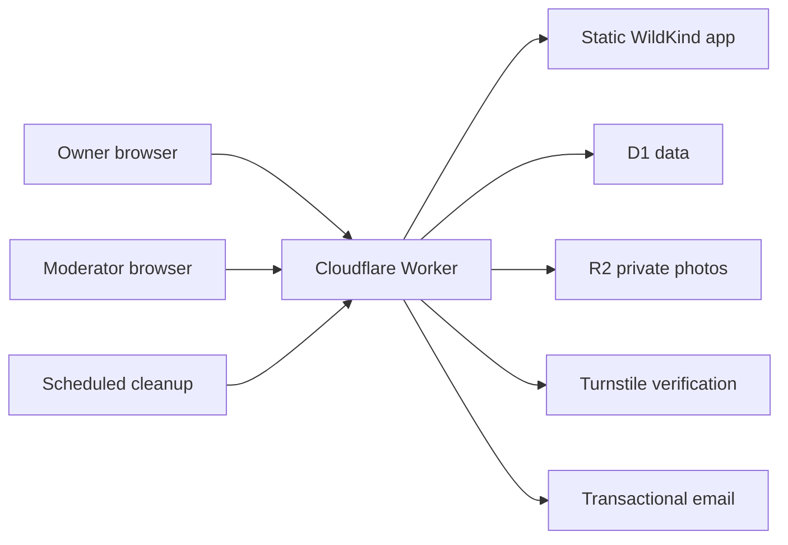

# WildKind MVP Requirements Document

**Status:** Product baseline for design and implementation  
**Product:** WildKind  
**Platform:** Responsive web application  
**Deployment target:** Cloudflare  
**Initial audience:** Adult dog and cat owners  
**Related scientific specification:** `WildKind_Assessment_Program.md`

---

## 1. Product summary

WildKind is a pet personality and social discovery platform built around one belief:

> Beneath every domesticated pet dwells a wild soul. Our task is not to tame it, but to understand it.

Owners follow a short behavioral expedition, receive a five-dimensional personality map and narrative WildKind archetype, learn practical ways to support their pet, and discover owners of pets with relevant personalities and needs.

The MVP must prove one product loop:

```text
Explore personality → recognize the result → create a pet profile
→ discover relevant pets → connect by mutual consent → begin a safe conversation
```

WildKind does not diagnose animals, predict aggression, certify compatibility, or reproduce MBTI for pets. Its scientific output is a continuous behavioral profile. The narrative archetype makes that profile memorable without replacing it.

---

## 2. Brand foundation

### 2.1 Core positioning

| Dimension | WildKind definition |
|---|---|
| Core belief | Beneath every domesticated pet dwells a wild soul. Our task is not to tame it, but to understand it. |
| Brand archetype | **Sage + Explorer:** WildKind decodes behavior carefully while making discovery feel adventurous. |
| Tone | **Warm science:** informed but never clinical, warm but never babyish—like a wildlife biologist who is also a trusted friend. |
| Product role | The map and compass that help owners understand the nature beneath learned behavior and domestic life. |
| User role | The attentive explorer of their pet's individual behavioral territory. |
| Narrative tension | Domesticated exterior; individual, partly untamed nature beneath. |

### 2.2 Tagline hierarchy

| Level | Approved wording | Primary use |
|---|---|---|
| Primary tagline | **What's Your Pet's WildKind?** | Main campaign line, social biography, assessment entry CTA |
| Science tagline | **Decoding the Nature Beneath the Nurture** | Landing-page hero support, research and methodology pages |
| Emotional tagline | **They Look Tame. They Feel Wild.** | Manifesto, launch video, emotional campaign moments |

Rules:

- The primary tagline is the default public-facing question.
- The science tagline explains credibility; it should not compete visually with the primary CTA.
- The emotional tagline is used selectively. It must not imply that pets are dangerous or unsuitable for domestic life.
- Taglines retain the approved capitalization and punctuation unless a channel has strict character limitations.

### 2.3 Approved short brand statement

> We don't believe in “good pets” and “bad pets.”  
> We believe in wild souls wearing domesticated coats.  
> Some are explorers. Some are guardians. Some are chaos agents with a heart of gold.  
> WildKind doesn't label your pet. It translates them.  
> So you can stop guessing—and start understanding.

This statement may appear on the About page and in launch materials. Short interfaces should use excerpts rather than repeating the entire manifesto.

### 2.4 Narrative framework

WildKind replaces the generic “online pet test” journey with a wilderness-exploration journey. The metaphor supports the experience but must never obscure instructions or scientific limitations.

| Generic product term | Preferred user-facing term | Technical/internal term |
|---|---|---|
| Take the test | Begin the expedition / Explore their WildKind | Start assessment |
| Question | Field observation | Questionnaire item |
| Progress | Trail progress | Completion percentage |
| Personality scores | Personality map / five coordinates | Domain scores |
| Results | Field Guide | Result report |
| Personality type | WildKind archetype | Narrative profile |
| Retake | Return to the trail / Map what changed | Retest |
| Match | Shared terrain / relevant connection | Recommendation ranking |

Product copy may say “assessment” when clarity or consent requires it. It must not turn a safety warning, medical context, privacy choice, or error message into a metaphor.

---

## 3. Visual identity requirements

### 3.1 Color system

The interface should feel like a night field station, a geological survey map, and a refined natural-history publication—not a candy-colored pet application.

| Token | Name | Value | Required role |
|---|---|---:|---|
| `--color-obsidian` | Obsidian | `#1A1816` | Primary background, dark wordmark, navigation, high-contrast framing |
| `--color-wild-sand` | Wild Sand | `#E8D5B5` | Primary light text, light surfaces, highlights, Field Guide paper tone |
| `--color-moss` | Moss | `#6B8A5A` | Positive states, active filters, completion, calm discovery cues |
| `--color-terracotta` | Terracotta | `#8A6B5A` | Warm emotional accents, bonding-related visual cues |
| `--color-slate` | Slate | `#5A7A8A` | Scientific data, charts, explanatory diagrams |
| `--color-ember` | Ember | `#C4703A` | Primary CTA, important markers, selected trail point |

Usage requirements:

- Wild Sand on Obsidian is the default dark-theme text pairing.
- Obsidian on Wild Sand is the default Field Guide/report pairing.
- Obsidian on Ember is the default primary-button pairing.
- Moss, Terracotta, Slate, and Ember are semantic accents, not four competing brand colors in every screen.
- Terracotta and Slate do not provide sufficient contrast for normal-sized text against Obsidian or Wild Sand; use them for large labels, charts, borders, textures, or icons with a separate accessible text label.
- Charts must use labels, shapes, line styles, or patterns in addition to color.
- Focus, error, warning, success, and disabled states must remain distinguishable in grayscale.

### 3.2 Typography

| Role | Preferred family | Behavior |
|---|---|---|
| Display | Neue Haas Grotesk or Söhne Breit | Bold, slightly narrow, confident, high-impact |
| Body and UI | GT America or Söhne | Warm, editorial, highly readable |
| Archetype accent | A restrained editorial serif may be tested in Field Guide headings only | Natural-history field-guide feeling; never used for dense body copy or data |

Requirements:

- Confirm commercial webfont licensing before implementation.
- If licensed fonts are unavailable for MVP, use a documented metric-compatible or system fallback; do not download unlicensed font files.
- Display type may use tight tracking at large sizes but must not compromise mobile readability.
- Minimum body size is 16 CSS pixels under normal browser settings.
- Scientific values and tabular data use tabular numerals where supported.
- Archetype typography must remain subordinate to the actual dimension data.

### 3.3 Logo system

The logo system contains three directions:

1. **Contour Paw:** A stylized paw whose pads form topographic contours—“each paw leaves a unique topographical mark.”
2. **Compass Claw:** A compass rose with a subtle claw shadow—“navigating the wild heart.”
3. **WildKind Type Mark:** A confident wordmark with a small leaf or claw intervention in the W or K.

MVP decision:

- Use the **WildKind Type Mark** as the primary header and email logo because it is the most legible and adaptable at small sizes.
- Develop the **Contour Paw** as the favicon, profile seal, loading marker, and share-card stamp.
- Use the **Compass Claw** as a secondary campaign or Field Guide motif, not a competing primary logo.
- Final marks require originality, trademark screening, small-size testing, monochrome variants, and accessibility labels.
- Do not rely on decorative paw imagery to communicate navigation or button meaning.

### 3.4 Image and texture direction

- Favor dark-toned, observational pet photography with natural posture and real environments.
- Avoid costumes, exaggerated facial manipulation, infantile props, and generic stock-photo smiles.
- Contour overlays, coordinate marks, field-note rules, geological strata, and subtle paper grain may support the exploration system.
- Overlays must not obscure the pet's eyes, body-language signals, or essential text.
- Result reports use a Wild Sand paper-like surface, topographic detail, clear data typography, and restrained editorial spacing—similar in spirit to a premium natural-history field guide.
- Textures must be lightweight, responsive, and optional under reduced-data or high-contrast modes.

### 3.5 Motion and interaction

- Progress may be represented as a trail advancing across a simple topographic field.
- Score bars may “map in” once, then remain stable.
- Motion must be subtle, under 300 milliseconds for routine interaction, and disabled under `prefers-reduced-motion`.
- Avoid bouncing paws, cartoon animal motion, gamified streak pressure, or effects that make the assessment feel unserious.

---

## 4. Brand voice and content rules

### 4.1 Voice attributes

| Attribute | Do | Avoid |
|---|---|---|
| Warm | “Your cat may prefer time to study a change before approaching.” | “Your fur baby is just a shy little bean.” |
| Scientific | Describe situation, behavior, context, and uncertainty. | Use mysterious algorithm claims or unsupported precision. |
| Exploratory | “Here is what this part of their map may mean.” | Turn every button or error into an expedition joke. |
| Nonjudgmental | “Less frequently expressed in this assessment.” | “Bad,” “stubborn,” “antisocial,” “neurotic,” or “difficult.” |
| Practical | Give one safe action and a sign to observe. | Offer universal training prescriptions. |
| Honest | “This profile is based on your recent observations.” | “We discovered your pet's true personality.” |

### 4.2 Required copy examples

**Hero**

- Eyebrow: `Decoding the Nature Beneath the Nurture`
- Headline: `What's Your Pet's WildKind?`
- Supporting line: `Map five behavioral dimensions, discover their WildKind archetype, and learn what helps them thrive.`
- CTA: `Begin the expedition`
- Secondary action: `See how the map works`

**Assessment introduction**

> Every good map begins with careful observation. Think about your pet's behavior during the last 30 days and answer from real situations—not the personality you hope they have. There are no good or bad coordinates.

**Result transition**

> The trail is mapped. Here is the pattern your observations reveal.

**Scientific limitation**

> WildKind describes recurring behavioral tendencies. It is not veterinary advice, an aggression assessment, or a guarantee that animals or people can interact safely.

**Community recommendation**

> You share similar social energy and exploration patterns. That makes this profile relevant—not automatically compatible.

### 4.3 Channel applications

| Channel | Requirement |
|---|---|
| Instagram | Dark observational photography, restrained contour overlay, one behavioral insight, and an actionable caption. Example structure: “Your cat isn't lazy. Their map shows lower Social Energy. Here's what that can mean.” |
| Field Guide result | Wild Sand surface, topographic detail, archetype title with editorial emphasis, sans-serif data, plain-language care actions |
| Accessories | Archetype name and one original symbol; minimalist enough to wear without looking like promotional merchandise |
| Email | Personalized + intriguing + actionable subject. Example: “Milo maps closest to Storm Chaser. Here's what may help.” Avoid presenting the archetype as a fact. |
| Social share card | Pet photo, archetype, two strongest dimensions, primary tagline or contour seal; no exact location or health context |

---

## 5. MVP goals and exclusions

### 5.1 MVP goals

Owners must be able to:

- Complete the WildKind Snapshot for a dog or cat.
- Receive five continuous dimension scores and one provisional archetype.
- Receive three behavior-based care suggestions.
- Save the result to a private pet profile.
- Opt a profile into community discovery.
- Discover relevant pets using goal, general location, and behavioral profile.
- Send and accept connection requests.
- Exchange asynchronous text messages after mutual acceptance.
- Block, report, unpublish, export, and delete their data.

### 5.2 Out of scope

- Veterinary diagnosis or treatment
- Aggression prediction or compatibility certification
- Native mobile applications
- In-person Enhanced Profile booking
- Real-time presence, voice, video, or attachments
- Public content feed, comments, groups, or events
- Payments, advertising, commerce, or subscriptions
- Population percentiles before valid species-specific norms exist
- AI-generated scoring or opaque personality conclusions
- Exact location, live maps, or public distance to a home
- Additional species before independent development and validation

---

## 6. Primary users

### Curious owner

Wants a credible and emotionally resonant way to understand an individual pet.

**Job:** “Translate the patterns I see into something useful.”

### Connection seeker

Wants to meet owners whose pets share relevant activity, social, care, or recovery patterns.

**Job:** “Help me find people who understand a pet like mine.”

### Safety-conscious explorer

Wants control over visibility, location, contact, and real-world introductions.

**Job:** “Let me explore without giving strangers unnecessary access.”

### Moderator

Needs an auditable way to address reports, spam, harassment, and unsafe content.

**Job:** “Help me act consistently while respecting private communication.”

---

## 7. Core journeys

### 7.1 Expedition and activation

1. Visitor encounters the hero, brand belief, and limitations.
2. Visitor selects dog or cat and begins anonymously.
3. Visitor completes 25 scored field observations and seven context questions.
4. WildKind calculates five dimension scores, coverage, context flags, and the nearest archetype.
5. Visitor opens the Field Guide result.
6. Visitor creates an account to save it.
7. Owner adds a photo, biography, general region, goals, and visibility choice.
8. Owner explores relevant profiles and sends a connection request.
9. Recipient accepts; asynchronous messaging opens.

### 7.2 Safety

1. Block and Report appear on every discoverable profile and conversation.
2. Blocking immediately removes reciprocal discovery and messaging access.
3. Reports capture a category, optional explanation, content references, and timestamp.
4. Moderator reviews the minimum necessary context and records an action.

### 7.3 Data deletion

1. User opens Privacy and Data.
2. User requests and confirms account deletion.
3. Account and public profiles are disabled immediately.
4. Personal data is deleted or irreversibly de-identified under the published retention policy, subject to narrow legal or safety retention.

---

## 8. Functional requirements

Priority: **P0** launch requirement, **P1** near-term follow-up, **P2** later.

### 8.1 Brand and landing

| ID | Requirement | Priority |
|---|---|---|
| BR-01 | Product name is WildKind everywhere, including metadata, email, reports, legal copy, and analytics labels. | P0 |
| BR-02 | Landing hero uses the approved science tagline, primary tagline, support line, and “Begin the expedition” CTA. | P0 |
| BR-03 | Landing explains traits before archetypes and shows the five dimensions. | P0 |
| BR-04 | Brand manifesto appears once on the About section, not repeatedly throughout the funnel. | P0 |
| BR-05 | Visual implementation uses the approved color tokens and accessibility restrictions. | P0 |
| BR-06 | MVP uses the Type Mark as primary logo and Contour Paw as secondary seal/favicon. | P0 |
| BR-07 | All public copy passes a warm-science and nonjudgmental-language review. | P0 |

### 8.2 Authentication and consent

| ID | Requirement | Priority |
|---|---|---|
| AU-01 | Visitors may complete one unsaved expedition anonymously. | P0 |
| AU-02 | Saving, discovery, connections, messaging, reports, and blocks require authentication. | P0 |
| AU-03 | Use email one-time-code or magic-link authentication with secure, HttpOnly, SameSite cookies. | P0 |
| AU-04 | Sign-up, code requests, and repeated attempts are rate-limited and protected from automation. | P0 |
| AU-05 | Require minimum-age confirmation appropriate to the launch jurisdiction. | P0 |
| AU-06 | Separate service, research, marketing, and public-profile consent. | P0 |

### 8.3 Pet profile

| ID | Requirement | Priority |
|---|---|---|
| PF-01 | Support up to three dog or cat profiles per owner. | P0 |
| PF-02 | Store name, species, life stage, optional breed, photo, short biography, activity preference, interaction notes, and general region. | P0 |
| PF-03 | Default visibility is Private; Discoverable requires explicit opt-in. | P0 |
| PF-04 | Owner chooses which WildKind scores and archetype are public. | P0 |
| PF-05 | Photos are validated, stripped of location metadata, privately stored, and moderated before public display. | P0 |
| PF-06 | Owner may edit, unpublish, or delete a pet profile. | P0 |

### 8.4 WildKind Snapshot expedition

| ID | Requirement | Priority |
|---|---|---|
| EX-01 | Present the 30-day observation frame and species-appropriate examples. | P0 |
| EX-02 | Administer 25 scored items: five per approved dimension. | P0 |
| EX-03 | Administer seven context and data-quality items. | P0 |
| EX-04 | Response choices are Never, Rarely, Sometimes, Often, Almost always, and Not observed/not applicable. | P0 |
| EX-05 | Autosave after each answer; permit backward navigation before submission. | P0 |
| EX-06 | Display trail progress without revealing scoring keys. | P0 |
| EX-07 | Reverse-score items 5, 10, 15, 20, and 25. | P0 |
| EX-08 | Require four available items to calculate a dimension; score equals keyed mean multiplied by 25. | P0 |
| EX-09 | Context flags modify explanation but never add or subtract score points. | P0 |
| EX-10 | Store questionnaire, translation, scoring, archetype, and recommendation versions. | P0 |
| EX-11 | Support a three-to-six-month return expedition and comparison. | P1 |

### 8.5 Field Guide result

| ID | Requirement | Priority |
|---|---|---|
| FG-01 | Show the five continuous dimensions before the archetype. | P0 |
| FG-02 | Show coverage and relevant health or context cautions. | P0 |
| FG-03 | Assign a provisional archetype using the transparent nearest-prototype method. | P0 |
| FG-04 | Show a blended result when two archetypes are nearly tied. | P0 |
| FG-05 | Generate three recommendations from scores and context, not the archetype name alone. | P0 |
| FG-06 | Use Wild Sand Field Guide styling with accessible data labels and restrained topographic motifs. | P0 |
| FG-07 | Suppress playful interpretation when a sudden or concerning behavior change requires professional guidance. | P0 |
| FG-08 | Provide a privacy-safe share card with archetype and selected dimensions. | P1 |
| FG-09 | Do not show population percentiles, diagnoses, or numerical confidence intervals in MVP. | P0 |

### 8.6 Discovery and recommendation

| ID | Requirement | Priority |
|---|---|---|
| DS-01 | Only Discoverable, moderation-eligible profiles appear. | P0 |
| DS-02 | Filters include species, general region, life stage, goal, activity preference, and archetype. | P0 |
| DS-03 | Goals include similar-personality community, calm companionship, active enrichment, walking/outing, care discussion, and potential pet introduction. | P0 |
| DS-04 | Rank by goal alignment, five-dimensional relevance, activity preference, coarse location, and profile quality. | P0 |
| DS-05 | Explain recommendations through two or three plain-language “shared terrain” signals. | P0 |
| DS-06 | Any match score is labeled an app recommendation score, never a safety probability. | P0 |
| DS-07 | Never expose exact distance in sparse areas. | P0 |

### 8.7 Connections, messages, and safety

| ID | Requirement | Priority |
|---|---|---|
| CM-01 | Connection request identifies the relevant pets and stated goal. | P0 |
| CM-02 | Messaging opens only after mutual acceptance. | P0 |
| CM-03 | MVP messages are plain-text and asynchronous; no files, voice, or video. | P0 |
| CM-04 | Block and report are accessible from every profile and conversation. | P0 |
| CM-05 | Blocking immediately prevents discovery, requests, and new messages in both directions. | P0 |
| CM-06 | Reports support harassment, spam, unsafe advice, inappropriate content, impersonation, underage concern, and Other. | P0 |
| CM-07 | Moderators can dismiss, warn, remove content, suspend temporarily, or suspend permanently with an audit trail. | P0 |
| CM-08 | Moderators cannot browse private messages without a report or documented safety/legal need. | P0 |

---

## 9. Recommendation logic

The recommendation score helps order discovery results; it does not predict safe interaction.

| Signal | Provisional weight |
|---|---:|
| Goal alignment | 30% |
| Personality-profile relevance | 30% |
| Activity and interaction preferences | 20% |
| General-location relevance | 10% |
| Profile recency and completeness | 10% |

For a Similar preference, favor smaller five-dimensional distance. For Complementary, use explicit desired dimensions rather than maximizing every difference. For No preference, do not use personality in ranking.

Approved explanation:

> You share similar Social Energy and Discovery Drive. That makes this profile relevant—not automatically compatible.

---

## 10. Information architecture

### Public

- Home
- How the map works
- The five dimensions
- Begin the expedition
- About WildKind
- Safety and community guidelines
- Privacy and terms

### Authenticated

- Basecamp dashboard
- Pet profiles
- Expedition and Field Guide
- Discover
- Connections
- Messages
- Notifications
- Privacy and data settings

“Basecamp” may appear as a friendly dashboard title, but primary navigation should also contain the conventional word Dashboard for clarity and accessibility.

### Internal

- Moderation queue
- Report and evidence detail
- Account/action history
- Questionnaire and rule versions
- Product, assessment-quality, and safety metrics

---

## 11. Data and API requirements

### 11.1 Core records

- User, session, consent, and notification preference
- Pet, pet photo, profile visibility, and discovery preference
- Assessment, response, domain result, archetype result, and recommendation
- Connection, conversation, message, block, and report
- Moderation action and audit record
- Versioned questionnaire, translation, scoring key, archetype library, and recommendation rules

### 11.2 Representative endpoints

| Method | Endpoint | Purpose |
|---|---|---|
| POST | `/api/auth/request-code` | Request sign-in code |
| POST | `/api/auth/verify-code` | Verify and create session |
| GET/POST | `/api/pets` | List or create pet profiles |
| PATCH/DELETE | `/api/pets/:id` | Update or delete authorized pet |
| POST | `/api/pets/:id/photo` | Upload validated photo |
| POST | `/api/expeditions` | Create assessment session |
| PUT | `/api/expeditions/:id/responses` | Autosave responses |
| POST | `/api/expeditions/:id/submit` | Validate, score, and finalize |
| GET | `/api/field-guides/:id` | Retrieve authorized result |
| GET | `/api/discover` | Retrieve relevant profiles |
| POST/PATCH | `/api/connections` | Send, accept, or decline request |
| GET/POST | `/api/conversations/:id/messages` | List or send authorized messages |
| POST | `/api/blocks` | Block account |
| POST | `/api/reports` | Submit report |
| DELETE | `/api/account` | Begin deletion |

The branded route nouns may be used in the public API, but internal schema and code documentation must explicitly map `expedition = assessment` and `field guide = result report`.

---

## 12. Cloudflare architecture

| Layer | Service | Responsibility |
|---|---|---|
| Web application and API | Cloudflare Workers | Serve application routes and authorization-controlled APIs |
| Frontend assets | Workers Static Assets | HTML, JavaScript, CSS, logos, icons, and public brand assets |
| Relational data | Cloudflare D1 | Users, pets, assessments, connections, messages, reports, and moderation |
| Private media | Cloudflare R2 | Pet photos and generated share cards |
| Abuse protection | Cloudflare Turnstile | Protect sign-up, code requests, reports, and abuse-prone actions; validate tokens server-side |
| Scheduled tasks | Cron Triggers | Cleanup, retention, notification, and moderation reminders |
| Transactional email | External email provider called from Worker | Authentication and service notifications |



Deployment requirements:

- Development, staging, and production use separate databases, buckets, secrets, Turnstile widgets, and domains.
- Secrets never enter source control.
- D1 migrations are reviewed, versioned, tested from a clean database, and designed for rollback compatibility.
- R2 keys use opaque IDs rather than email addresses or pet names.
- Static brand assets are content-hashed and cached; private API responses are not stored in shared caches.
- Photo delivery removes EXIF location data and enforces authorization/moderation status.
- Release flow is automated tests → staging deployment → smoke test → production deployment.

---

## 13. Privacy, security, and trust

- Profiles default to Private.
- Store only user-selected city/region and coarse search geography, never live location.
- Use short-lived, single-use sign-in codes and revocable sessions.
- Enforce ownership and relationship authorization on every private object.
- Sanitize user text and render links safely.
- Validate media signatures, size, dimensions, and type.
- Rate-limit authentication, profile creation, uploads, connection requests, messages, and reports.
- Keep research participation optional and separate from product use.
- Do not analyze private message bodies for routine product analytics.
- Provide in-product export and deletion paths.
- Publish retention periods for accounts, messages, reports, deleted content, media, and logs.

Required disclaimer:

> WildKind describes recurring behavioral tendencies based on recent observations. It is not veterinary advice, an aggression assessment, or a guarantee that animals or people can interact safely. Introduce animals gradually and supervise interactions.

---

## 14. Non-functional requirements

### Accessibility

- Target WCAG 2.2 AA.
- Keyboard-operable expedition, navigation, profiles, filters, and messaging.
- Visible focus, logical focus order, semantic labels, and chart text alternatives.
- Color is never the only data or status signal.
- Approximately 44×44 CSS-pixel touch targets.
- Support reduced motion, browser zoom, and high-contrast settings.

### Performance

- Target p75 Largest Contentful Paint below 2.5 seconds.
- Target p75 Interaction to Next Paint below 200 milliseconds.
- Responsive images, lazy discovery cards, and lightweight texture assets.
- Do not preload decorative geological textures ahead of essential content.

### Reliability

- Autosave after every observation response.
- Submission is idempotent and cannot create duplicate final reports.
- Message sends use idempotency keys.
- Interrupted image uploads do not create public orphan records.
- Scheduled cleanup handles expired codes, abandoned uploads, and deletion workflows.

### Localization

- Brand taglines have approved localized variants rather than literal unsupervised translation.
- Item IDs and scoring remain stable across languages.
- Store translation version with each assessment.
- Keep scientific and safety review separate for each language.

---

## 15. Success metrics

### North-star behavior

**Meaningful WildKind connections per activated owner:** accepted connections in which both owners send at least one message within seven days.

### Funnel

- Hero → expedition start
- Start → completed Field Guide
- Completion → saved account
- Saved result → completed pet profile
- Pet profile → discovery session
- Discovery → connection request
- Request → acceptance
- Acceptance → two-way conversation

### Assessment quality

- Completion time and completion rate
- “Not observed” rate by item and species
- Dimensions with insufficient coverage
- Field Guide usefulness rating
- Archetype resonance rating
- Recommendation save/try intent

### Brand health

- Unaided understanding of what WildKind does
- Percentage correctly identifying the product as behavioral guidance rather than diagnosis
- Recall of the primary tagline
- Warmth, credibility, and distinctiveness ratings
- Percentage who understand archetype versus continuous score

### Safety

- Reports and blocks per 1,000 requests/conversations
- Median moderation response time
- Repeat-offender rate
- Percentage resolved within policy target

Pilot hypotheses:

- 60% of expedition starters complete it.
- 35% of completers save a pet profile.
- 25% of activated owners send a relevant request within seven days.
- 30% of connection requests are accepted.
- 20% of accepted connections become two-way conversations.
- Fewer than 2% of requests lead to a report during the pilot.

---

## 16. MVP acceptance criteria

### Brand

- No former working name remains in public copy, metadata, routes, email, reports, or analytics.
- Approved colors, typography policy, Type Mark, tagline hierarchy, and voice rules are implemented consistently.
- Contrast, zoom, keyboard, reduced-motion, and mobile checks pass.
- Warm-science review finds no infantile, moralizing, diagnostic, or mystery-algorithm language.

### Assessment

- All 32 approved items match the scientific specification.
- Reverse scoring, missing data, context flags, and reference examples pass automated tests.
- Five scores precede the archetype.
- No percentile, diagnostic, or compatibility-guarantee wording appears.

### Accounts and community

- Private profiles cannot be discovered or retrieved without authorization.
- Messaging cannot begin before acceptance.
- Blocks prevent reciprocal discovery, requests, and messaging.
- Reports preserve necessary evidence and enter an auditable queue.
- Account deletion removes public presence immediately.

### Operations

- Cloudflare staging and production resources are separated.
- Migrations, backup/export, restore, rollback, incident response, and moderation procedures are rehearsed.
- Privacy policy, terms, community guidelines, retention schedule, and safe-meeting guidance are published.

---

## 17. Delivery plan

### Phase 0 — Brand and research lock

- Confirm WildKind name and trademark availability in launch markets.
- Select and finish Type Mark and Contour Paw assets.
- Confirm font licensing or approve fallbacks.
- Freeze Snapshot v0.1 after dog, cat, welfare, and language review.
- Approve brand, privacy, retention, and moderation policies.

### Phase 1 — The Field Guide

- Branded landing page
- Anonymous expedition
- Transparent scoring and Field Guide
- Account creation and private pet profile
- Cloudflare development and staging environments

### Phase 2 — Controlled exploration

- Discoverable profiles
- Recommendation explanations
- Mutual connections
- Asynchronous messages
- Block, report, and moderation queue
- Invite-only pilot in one geographic or existing pet-owner community

### Phase 3 — Public beta

- Improve funnel using pilot evidence
- Add privacy-safe share card
- Strengthen moderation operations
- Expand geography carefully
- Introduce longitudinal return expeditions

---

## 18. Risks and mitigations

| Risk | Mitigation |
|---|---|
| “Wild” is interpreted as dangerous | Pair exploration language with observable behavior and gentle, non-sensational photography |
| The metaphor obscures instructions | Use conventional labels for consent, safety, errors, and accessibility; test comprehension |
| Archetypes become fixed labels | Always lead with continuous data and call archetypes provisional narrative matches |
| Brand warmth weakens scientific trust | Show measurement source, coverage, context, versions, and limitations |
| Scientific language feels cold | Translate data into one practical observation and one safe action |
| Visual palette creates contrast failures | Restrict body text to verified high-contrast pairs and label charts beyond color |
| Proprietary fonts delay launch | Confirm licenses early and approve fallbacks before UI build |
| Matching is mistaken for safety | Explain relevance, never probability; provide introduction guidance everywhere needed |
| Low community density | Pilot within one city or existing owner community |
| Harassment or spam | Mutual acceptance, rate limits, Turnstile, block/report, and staffed moderation |
| Location reveals a household | Coarse geography, automatic broadening, and no exact distance |

---

## 19. Decisions required before implementation

1. WildKind trademark and domain clearance
2. Final Type Mark and Contour Paw artwork
3. Licensed typography or approved fallback families
4. Initial pilot geography and partner community
5. Minimum user age and launch jurisdictions
6. Transactional email provider
7. Photo moderation process and staffing
8. Retention periods and legal/privacy owner
9. Whether the pilot permits in-person pet-introduction goals
10. Pilot size, duration, and stop/go thresholds

---

## 20. Post-MVP roadmap

- Longitudinal personality mapping and reliable-change interpretation
- In-person Enhanced Profile with trained assessors
- Species- and life-stage-specific norms
- Verified behavior-professional profiles
- Field Guide accessories using original archetype symbols
- Small groups organized around care needs
- Local outings and events with additional safety controls
- Additional species modules developed and validated independently

The roadmap begins only after the MVP demonstrates that owners complete the expedition, understand the map, value the guidance, find relevant profiles, and form safe two-way connections.
